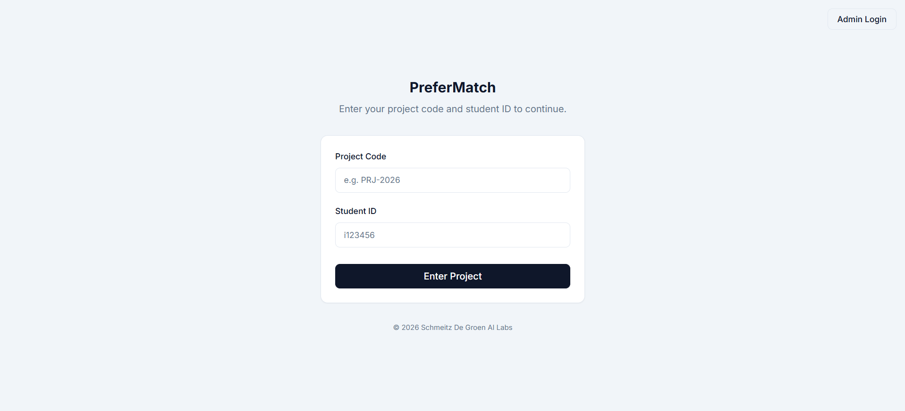
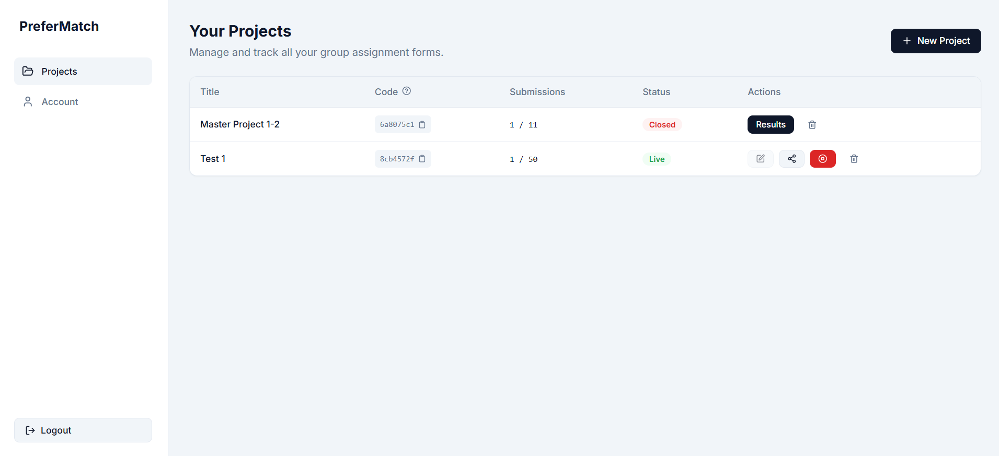
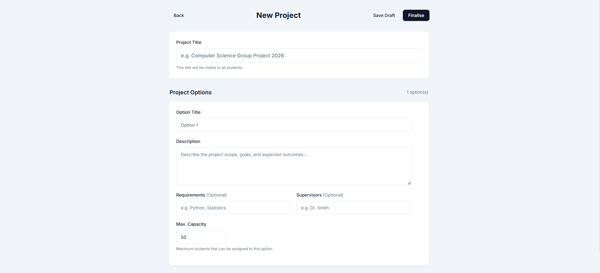
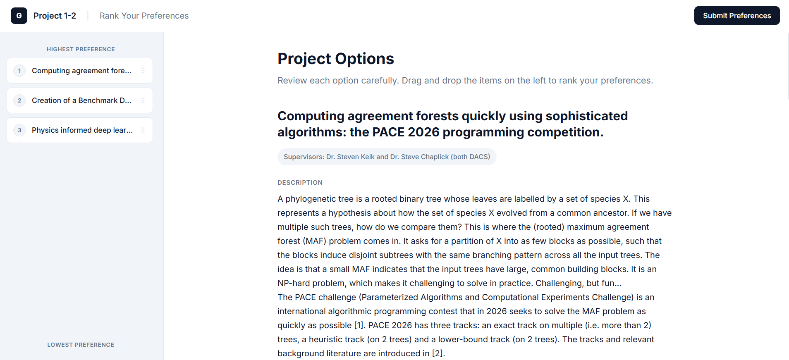

# University Group Assignment Application

A Dockerized web application to automate the process of assigning students to university projects/groups based on their preferences using an optimization algorithm. This tool replaces error-prone manual Google Forms with a secure, dedicated platform.

## 🎯 Goal
To eliminate the risk of mistakes in manual student-project assignment by providing:
1.  **Immutability**: Once a form is live/student submission starts, it ensures data consistency.
2.  **Validation**: Ensures valid student IDs and unique project codes.
3.  **Optimization**: Uses a mathematical algorithm (Linear Sum Assignment / Min-Cost Flow) to maximize overall student satisfaction subject to option capacities.
4.  **Professional UI**: A modern, responsive interface for both students and administrators.

## 🚀 Features

### 🎓 Student Portal
- **Simple Access**: Login with a unique Project Code and valid Student ID (starts with 'i').
- **Interactive Ranking**: Drag-and-drop interface to rank project choices from most to least desired.
- **Detailed Views**: View full details, requirements, and supervisors for each project option.
- **Confirmation**: Review summary before final submission.

### 🏫 Admin/Teacher Dashboard
- **Secure Authentication**: Register/Login with Department, Email, and a secret `REGISTER_SECRET`.
- **Project Management**: 
    - Create new project forms with multiple options.
    - **Capacity Control**: Define min/max students per option (default 50).
    - **Smart Locking**: Project structure is **locked** once student submissions begin to prevent data corruption.
    - **Contextual Actions**: Share buttons only appear for active, open projects.
    - Close forms to stop submissions.
- **Algorithm & Results**:
    - **Auto-Calculation**: Results are automatically computed/recomputed on page load.
    - View assignments (Student -> Project).
    - **Export**: Download results as a clean JSON file.

## 📸 Interface Preview

### 1. Secure Admin Portal
The entry point for users to securely access the system.


### 2. Admin Dashboard
Manage all projects, view unique student access codes, and track submission progress.


### 3. Form Editor with Capacity Control
Create and edit project options, setting specific descriptions and student capacities for each.


### 4. Student Ranking Interface
Students easily rank their preferences using an intuitive drag-and-drop system.


## 🧠 Optimization Algorithm Explained

We use a robust mathematical approach to ensure the fairest possible distribution of students to projects.

### The Logic: Minimize "Cost"
Think of a student's preference as a "cost". Getting their 1st choice costs **1 point**, 2nd choice costs **2 points**, and so on. Our goal is to minimize the **Total Cost** for the entire group.

### Step-by-Step Process (Linear Sum Assignment)
1.  **Slot Expansion**: 
    If "Option A" has a capacity of 3, the algorithm treats it as 3 separate available seats: `A_1`, `A_2`, `A_3`. This converts the problem into a one-to-one matching problem.
    
2.  **Cost Matrix**: 
    We create a grid where every Student is a row and every Slot is a column.
    - If Student X ranked Option A as 1st choice, the "cost" for seats `A_1`, `A_2`, `A_3` is **1**.
    - If they didn't rank Option B, the cost is set very high (e.g., 1000) to discourage that assignment unless absolutely necessary.

3.  **The Solver (Hungarian Algorithm)**: 
    We use the `scipy.optimize.linear_sum_assignment` function. This explores combinations to find the unique set of assignments where the sum of all ranks is the lowest possible number.

**Why is this better than "First Come, First Served"?**
It considers the entire group's happiness. One student might get their 2nd choice so that two other students can get their 1st choice, resulting in a better overall outcome than one happy student and two unhappy ones.

## 🛠 Tech Stack

- **Infrastructure**: Docker & Docker Compose (Dev & Prod environments).
- **Backend**: Python **FastAPI** with **SQLite**.
    - Type-safe Pydantic schemas.
    - JWT Authentication (BCrypt + Salt + Pepper).
    - SQLAlchemy models.
    - **Scientific Computing**: `NumPy` and `SciPy` for optimization.
- **Frontend**: **React** (Vite) + TypeScript.
    - **Vanilla CSS** (Variables-based) for a premium, custom "Shadcn-like" look.
    - `@dnd-kit` for accessible drag-and-drop interactions.
    - Responsive design.

## 🔧 Setup & Installation

### Prerequisites
- Docker & Docker Compose installed.

### Environment Variables
Create a `.env` file in the root directory:

```env
# Backend Security
REGISTER_SECRET=change_me_in_production
PASSWORD_PEPPER=secure_pepper_value_here
SECRET_KEY=generate_a_secure_key_here
ACCESS_TOKEN_EXPIRE_MINUTES=30
```

### Running the App

**Development Mode**:
```bash
docker compose up --build -d
```
*   **Frontend**: http://localhost:5173
*   **Backend API**: http://localhost:8000/docs

**Production Mode**:
```bash
docker compose -f docker-compose.prod.yml up --build -d
```
*   **App**: http://localhost:5173 (Served via Vite Preview in this demo setup)

## 📂 Project Structure

```
├── backend/
│   ├── app/
│   │   ├── routers/       # API endpoints (admin, projects, students)
│   │   ├── algorithm.py   # Optimization logic (Hungarian Algorithm)
│   │   ├── auth.py        # Security & JWT
│   │   ├── models.py      # Database Schema
│   │   └── main.py        # App Entrypoint
│   └── Dockerfile
├── frontend_app/
│   ├── src/
│   │   ├── components/    # Reusable UI (Card, Button, Input)
│   │   ├── pages/         # Views (Landing, Dashboard, Preference, etc.)
│   │   └── index.css      # Global Design System
│   └── Dockerfile
└── docker-compose.yml
```

## 🔒 Security Measures
- **Password Hashing**: Bcrypt with unique salts and an additional server-side pepper.
- **Auth**: JWT (JSON Web Tokens) for protected admin routes.
- **Validation**: Strict Pydantic v2 validation for all inputs.
- **Isolation**: Docker containers run with limited context.
